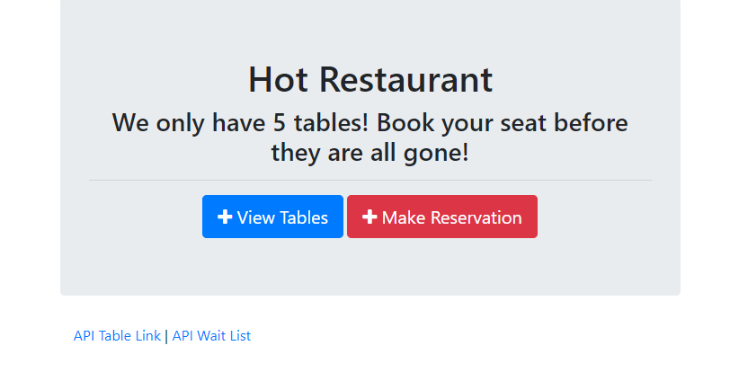

# hot-restaurant

## Description
A table reservation system for a small restaurant. It is a simple exercise in creating a front-end and back-end with an elementary API, making use of node.js and Express.

## Table of Contents
* [Installation](#Installation)
* [Usage](#Usage)
* [Screenshot](#Screenshot)
* [Deployment](#Deployment)
* [Credits](#Credits)

## Installation
To install, run the following command:
```
npm install
```

## Usage
Requires node.js to run. Start server with
```
npm start
```

## Screenshot
  

## Deployment
The web application has been deployed on Heroku at http://malenchite-restaurant.herokuapp.com

## Credits
#### NPM Packages
* [express](https://www.npmjs.com/package/express)  

Part of an in-class mini-project for the UNC Coding Bootcamp. Work was completed alongside Erik Brown and Monica Hill.
